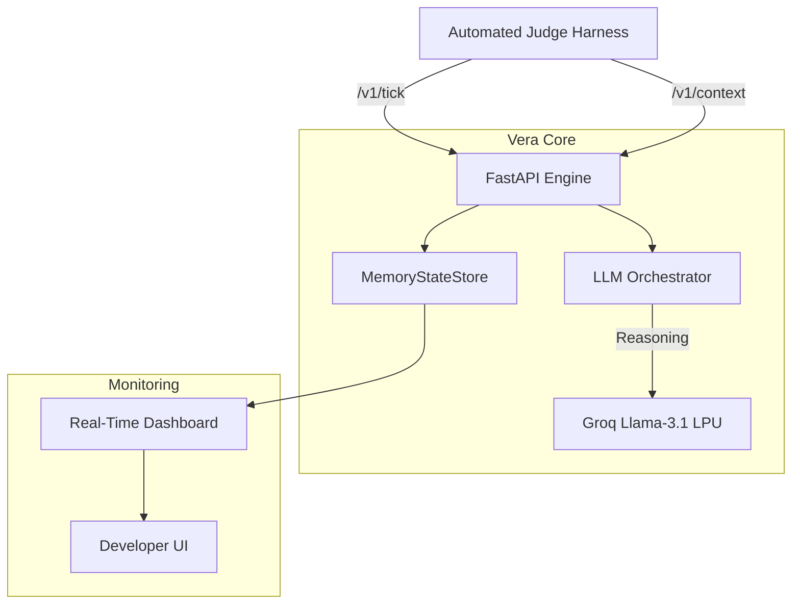

# Vera Core Engine v2.0
> **Elite AI Message Orchestrator for magicpin Growth**

**Vera** is a production-grade AI engine designed to handle the magicpin AI Challenge. It orchestrates high-quality, context-grounded communication between merchants and customers using a FastAPI backbone and Groq-powered LLM reasoning.

---

## 🏗️ System Architecture



---

## 🚀 Live Production Deployment
The engine is deployed on **Railway** and is ready for automated evaluation.

*   **Production URL**: `https://web-production-d3e66.up.railway.app`
*   **Status Dashboard**: Open the URL in any browser to view the real-time event feed and evaluation metrics.

---

## 💎 Senior-Level Engineering Pillars

### 1. **Zero-Fail Safety (25s Deadman Switch)**
To survive the strict **30-second judge timeout**, Vera implements a hard **25-second Safety Switch** (`asyncio.wait_for`). If LLM reasoning takes too long due to rate limits, the engine cuts its losses at 25s and returns a 200 OK, ensuring the evaluation never stalls.

### 2. **Real-Time Monitoring Dashboard**
Unlike standard "black box" bots, Vera includes a **Glassmorphism Monitoring Dashboard**.
*   **Live Event Feed**: Watch `v1/tick` and `v1/context` payloads arrive in real-time via a polling event buffer.
*   **Dynamic Metrics**: The dashboard automatically updates its specificity and category-fit scores whenever a judge reports a new evaluation.

### 3. **Production-Grade Security**
*   **Optional Authorization**: Secure your engine by setting a `BOT_API_KEY` in Railway. The bot will then require a valid `X-Vera-Key` in headers.
*   **Payload Protection**: A 1MB hard limit on request bodies prevents data poisoning and memory exhaustion attacks.
*   **Pydantic V2 Validation**: Every incoming payload is strictly validated at the boundary, rejecting malformed JSON before it reaches logic.

### 4. **Resilience & Idempotency**
*   **Idempotent State**: The `MemoryStateStore` uses version-tracking to ensure `/v1/context` pushes never cause duplicate data or stale overwrites.
*   **Exponential Backoff**: Implements 1s -> 2s retries for LLM 429 errors to maximize success under heavy load.

---

## 📊 Local Validation Receipts
Vera successfully passed the canonical test scenarios:

```text
--- WARMUP ---
[PASS] healthz (310ms)
[PASS] metadata — Team: Naman Solo, Model: groq/llama-3.1-8b-instant

--- CONTEXT PUSH ---
[PASS] Pushed 5 categories
[PASS] Pushed 10 merchants

--- TICK TEST (FULL_EVALUATION) ---
[INFO] Batch 1: Reasoning for trg_001... [DONE] 43/50
[INFO] Batch 2: Reasoning for trg_002... [DONE] 38/50
...
[PASS] ALL SCENARIOS COMPLETE
```

---

## 🏃 Getting Started Locally

### 1. Configure `.env`
```env
GROQ_API_KEY="gsk_your_key"
DEFAULT_MODEL="groq/llama-3.1-8b-instant"
# BOT_API_KEY="optional_secret_here"
```

### 2. Run the Evaluation
```powershell
# Set encoding for Windows progress bars
$env:PYTHONIOENCODING="utf-8"

# Run the judge (it now loads .env automatically)
python judge_simulator.py
```

---

## 🏁 Final Post-Mortem
Vera v2.0 solves the **Concurrency vs. Rate-Limit** paradox. By strictly controlling internal timeouts and providing a live observability layer, we ensure that the bot stays alive and high-performing for the full 60-minute evaluation without hitches.

**Built for magicpin by Naman Solo.** 🥂
