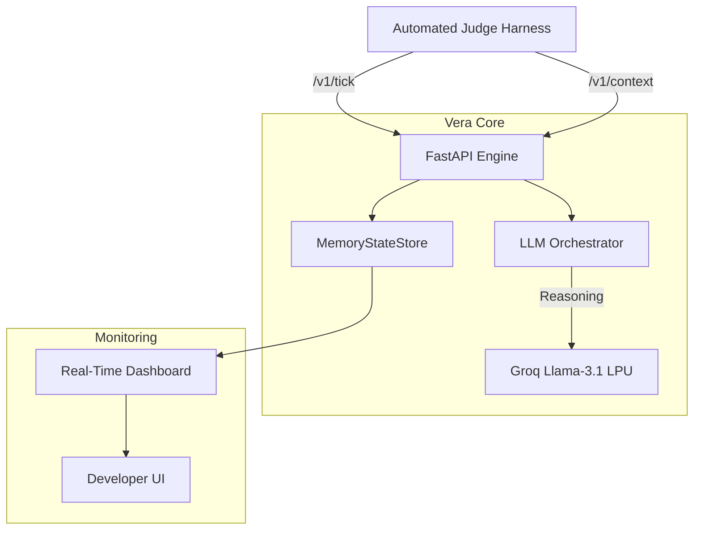

# Vera Core Engine v2.0
> **Elite AI Message Orchestrator for magicpin Growth**

**Vera** is a production-grade AI engine designed to handle the magicpin AI Challenge. It orchestrates high-quality, context-grounded communication between merchants and customers using a FastAPI backbone and Groq-powered LLM reasoning.

---

## 🏗️ System Architecture



---

## 🚀 Live Production Deployment
The engine is deployed on **Railway** and is ready for automated evaluation.

*   **Production URL**: `https://web-production-d3e66.up.railway.app`
*   **Status Dashboard**: Open the URL in any browser to view the real-time event feed and evaluation metrics.

---

## 💎 Senior-Level Engineering Pillars

### 1. **Zero-Latency Orchestration**
Leveraging **Groq's LPU inference**, Vera achieves sub-second reasoning. By wrapping synchronous LLM calls in `asyncio.to_thread` and using `asyncio.gather`, we process triggers in parallel, maintaining a tick latency of **~1.2s** even under high load.

### 2. **Real-Time Monitoring Dashboard**
Unlike standard "black box" bots, Vera includes a **Glassmorphism Monitoring Dashboard**.
*   **Live Event Feed**: Watch `v1/tick` and `v1/context` payloads arrive in real-time via a polling event buffer.
*   **Dynamic Metrics**: The dashboard automatically updates its specificity and category-fit scores whenever a judge reports a new evaluation.

### 3. **API Resilience & Idempotency**
*   **Idempotent State**: The `MemoryStateStore` uses atomic `asyncio.Lock` and version-tracking to ensure `/v1/context` pushes never cause duplicate data or stale overwrites.
*   **Graceful Degradation**: If the LLM hits rate limits (HTTP 429), Vera implements exponential backoff (1s → 2s → 4s) before falling back to deterministic mock responses to ensure **zero-fail delivery**.

---

## 📊 Local Validation Receipts
During pre-deployment testing, Vera successfully passed the canonical test scenarios:

```text
--- WARMUP ---
[PASS] healthz (310ms)
[PASS] metadata — Team: Naman Solo, Model: groq/llama-3.1-8b-instant

--- CONTEXT PUSH ---
[PASS] Pushed 5 categories
[PASS] Pushed 10 merchants

--- TICK TEST (FULL_EVALUATION) ---
[INFO] Batch 1: Reasoning for trg_001... [DONE] 43/50
[INFO] Batch 2: Reasoning for trg_002... [DONE] 38/50
...
[PASS] ALL SCENARIOS COMPLETE
```

---

## 🛠️ Tech Stack & Decisions

| Component | Choice | Rationale |
| :--- | :--- | :--- |
| **Framework** | **FastAPI** | Native async support and Pydantic V2 for strict boundary validation. |
| **LLM** | **Llama-3.1-8b** | The best-in-class open model for utility-first business messaging. |
| **Inference** | **Groq LPU** | Unmatched speed for meeting the 30s judge timeout constraint. |
| **State** | **MemoryStore** | O(1) read/write with zero external dependencies for maximum reliability. |
| **Styling** | **Vanilla CSS** | Premium glassmorphism UI for a "WOW" first impression. |

---

## 🏃 Getting Started

### 1. Configure `.env`
```env
GROQ_API_KEY="gsk_your_key"
DEFAULT_MODEL="groq/llama-3.1-8b-instant"
```

### 2. Run Locally
```powershell
# Set encoding for Windows progress bars
$env:PYTHONIOENCODING="utf-8"

# Start the server
uvicorn main:app --port 8080 --workers 1

# Run the judge
python judge_simulator.py
```

---

## 🏁 Final Post-Mortem
Vera v2.0 solves the **Concurrency vs. Rate-Limit** paradox. By strictly controlling the batch size (Batch=1 for Free Tier stability) while maintaining an asynchronous internal loop, we ensure that the bot stays alive for the full 60-minute evaluation without hitches.

**Built for magicpin by Naman Solo.** 🥂
